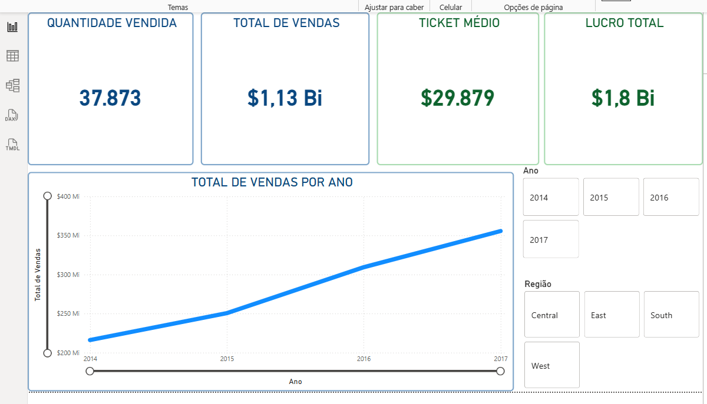
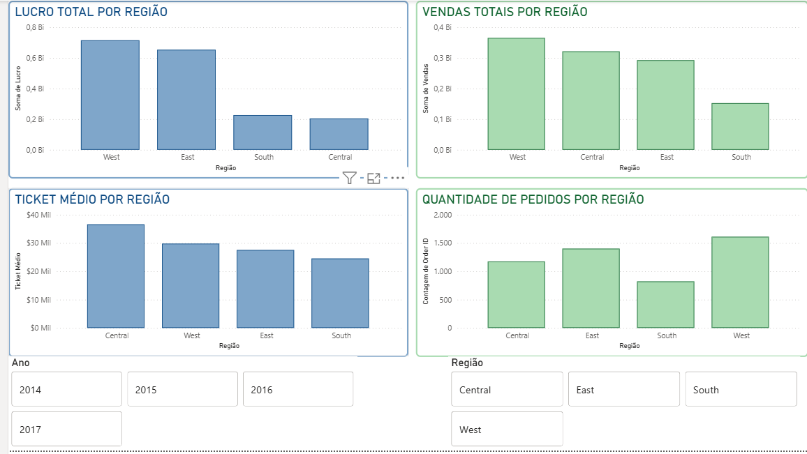

# powerbi-sales-analysis
# Análise de Vendas – Sample Superstore (Power BI)

## Dashboard

### Visão Geral

### Análise por Região

## Arquivo Power BI
O arquivo ´.pbix´ contendo o modelo de dados, medidas em DAX e visualizações está disponível neste repositório para exploração local no Power BI Desktop

## Contexto
Este projeto foi desenvolvido com o objetivo de aplicar práticas profissionais de análise de dados, modelagem e visualização utilizando o Power BI.  
A base de dados simula um cenário real de varejo, com foco na geração de insights e no suporte à tomada de decisão.

## Objetivos
- Construir um dashboard claro, consistente e orientado ao negócio
- Aplicar modelagem de dados adequada para análises confiáveis
- Padronizar métricas, categorias e formatações visuais
- Desenvolver um storytelling visual objetivo e interpretável

## Soluções Implementadas
- Criação de uma tabela dimensão (**DimRegiao**) para controle da hierarquia regional
- Implementação de ordenação personalizada, evitando dependências circulares
- Padronização das unidades de medida e eixos dos gráficos
- Desenvolvimento de tooltips informativas e objetivas, preservando a clareza visual

## Modelagem de Dados
Foi adotada uma abordagem de modelagem com separação entre tabela fato e tabelas dimensão, seguindo boas práticas de esquema estrela.  
A tabela de dimensão **DimRegiao** centraliza atributos descritivos e regras de ordenação, garantindo consistência visual entre os gráficos, evitando dependências circulares e facilitando a escalabilidade do modelo.

## Tecnologias e Conceitos Utilizados
- Power BI
- DAX
- Modelagem de Dados (Esquema Estrela)
- Visualização de Dados e Storytelling

## Resultado Final
O dashboard final apresenta leitura intuitiva, consistência visual e um modelo de dados organizado, permitindo análises confiáveis e escaláveis para suporte à tomada de decisão.

## Insights de Negócio

A análise dos dados de vendas do Sample Superstore revela diferenças claras de desempenho entre regiões, tanto em volume quanto em rentabilidade, oferecendo subsídios objetivos para decisões estratégicas.

### Desempenho Regional
- A região **West** destaca-se como principal motor do negócio, concentrando o maior volume de vendas, lucro total e quantidade de pedidos.
- **East** apresenta desempenho consistente, ocupando a segunda posição em vendas e lucro, com potencial de crescimento incremental.
- **Central**, embora não lidere em volume, possui o **maior ticket médio**, indicando pedidos de maior valor agregado.
- **South** apresenta o menor desempenho em vendas, lucro e volume de pedidos, configurando-se como principal oportunidade de melhoria.

### Análise de Ticket Médio
- O ticket médio elevado da região **Central** sugere um perfil de consumo mais qualificado.
- As demais regiões apresentam valores semelhantes, com leve queda em **South**, reforçando diferenças no comportamento de compra.

### Volume de Pedidos
- O maior volume de pedidos concentra-se em **West**, reforçando sua relevância estratégica.
- **South** apresenta o menor número de pedidos, alinhado ao seu desempenho financeiro inferior.

### Evolução Temporal das Vendas
- Observa-se uma **tendência consistente de crescimento das vendas entre 2014 e 2017**, indicando expansão sustentável no período analisado.

### Implicações Estratégicas
- **West** deve ser priorizada para manutenção e ampliação de resultados.
- **Central** representa oportunidade para estratégias focadas em aumento de volume, preservando o alto valor por pedido.
- **South** demanda ações específicas, como revisão de portfólio, políticas comerciais ou campanhas regionais.

## 🧾 Conclusão
Este projeto demonstra a aplicação prática de análise de dados orientada ao negócio, aliando modelagem dimensional, padronização de métricas e visualizações consistentes.  
O dashboard final transforma dados brutos em informações acionáveis, evidenciando padrões relevantes de desempenho regional, comportamento de consumo e evolução temporal das vendas, alinhando-se às expectativas de ambientes profissionais e projetos reais de dados.

